# Polyglot Codebase Knowledge Graph

> Generated offline by **readmenator**. Supports C, C++, Python, Go, Rust, JS/TS, Java, C#, Shell, PHP, Dart, GDScript, Nim, ASM.
> No LLMs. No tokens. Pure static analysis. See more [here](https://github.com/grisuno/ReadMenator)

**Total Files Parsed:** 8 | **Total Symbols Extracted:** 3 | **Total Imports:** 1

## Structural Knowledge Map

```mermaid
graph TD
    classDef mod fill:#1e1e1e,stroke:#ff6666,stroke-width:2px,color:#fff;
    classDef cls fill:#2d2d2d,stroke:#4ec9b0,stroke-width:2px,color:#fff;
    classDef fn fill:#333,stroke:#dcdcaa,stroke-width:1px,color:#dcdcaa;
    classDef ext fill:#111,stroke:#666,stroke-dasharray:5 5,color:#aaa;
    app_py["app.py (py)"]
    class app_py mod;
    gen_loader_sh["gen_loader.sh (sh)"]
    class gen_loader_sh mod;
    gen_loader_sh_usage["usage"]
    class gen_loader_sh_usage fn;
    gen_loader_sh --> gen_loader_sh_usage
    gen_loader2_sh["gen_loader2.sh (sh)"]
    class gen_loader2_sh mod;
    gen_loader2_sh_usage["usage"]
    class gen_loader2_sh_usage fn;
    gen_loader2_sh --> gen_loader2_sh_usage
    gen_loader_win_infect_sh["gen_loader_win_infect.sh (sh)"]
    class gen_loader_win_infect_sh mod;
    gen_loader_win_infect_sh_usage["usage"]
    class gen_loader_win_infect_sh_usage fn;
    gen_loader_win_infect_sh --> gen_loader_win_infect_sh_usage
    gen_txt_sh["gen_txt.sh (sh)"]
    class gen_txt_sh mod;
    gen_xor_sh["gen_xor.sh (sh)"]
    class gen_xor_sh mod;
    install_sh["install.sh (sh)"]
    class install_sh mod;
    main_sh["main.sh (sh)"]
    class main_sh mod;
    ext_os["os"]
    class ext_os ext;
    app_py -.->|imports| ext_os
```

---

## Architecture Reference

### PY (1 files)

#### `app.py`
**Path:** `app.py`

*No symbols extracted*

### SH (7 files)

#### `gen_loader.sh`
**Path:** `gen_loader.sh`

**Functions:**
- `usage` (line 9)

#### `gen_loader2.sh`
**Path:** `gen_loader2.sh`

**Functions:**
- `usage` (line 10)

#### `gen_loader_win_infect.sh`
**Path:** `gen_loader_win_infect.sh`

**Functions:**
- `usage` (line 11)

#### `gen_txt.sh`
**Path:** `gen_txt.sh`

*No symbols extracted*

#### `gen_xor.sh`
**Path:** `gen_xor.sh`

*No symbols extracted*

#### `install.sh`
**Path:** `install.sh`

*No symbols extracted*

#### `main.sh`
**Path:** `main.sh`

*No symbols extracted*
